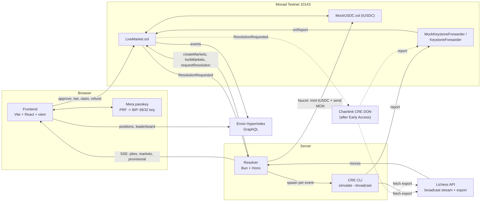

# MoveMarket

**Every move is a market.**

MoveMarket runs live YES/NO prediction pools on chess games streamed from Lichess. While a game is in progress, a resolver opens small pools about the next few plies ("Any check in plies 31 to 34?"). You stake test USDC within a 15 second window, the contract locks the pool before the first ply in the range can be played, the resolver shows a provisional result within seconds, and a Chainlink CRE workflow writes the final result onchain on Monad Testnet. Accounts come from a passkey through Mera, so you never see a seed phrase or a wallet popup.

Built for **Monad Metropolis**, Track 03 (Social, Attention & Culture). Bounties: Chainlink CRE, Monad Foundation (Mera UX), Envio.

| | |
|---|---|
| Live demo | TBD |
| Demo video (3 min) | TBD |
| Envio GraphQL endpoint | TBD |
| Network | Monad Testnet, chain ID `10143` |

## How a market works

1. **Spawn.** The resolver follows a Lichess game (a tournament broadcast, or a replay of a finished public game when nothing is live). Every 4 plies it sends one `createMarkets` transaction with a batch of questions: `CHECK ANY`, `CAPTURE ANY`, and while castling is still possible, `CASTLE WHITE` and `CASTLE BLACK`. The range always starts in the future: `fromPly = currentPly + plyGap + 1`, with `plyGap` 2 for classical and 4 for rapid games. A range covers 4 plies (8 for castling).
2. **Stake.** You pick YES or NO and tap a chip (1, 5 or 10 tUSDC). The frontend calls `bet()` on `LiveMarket` from your passkey account. Pools are parimutuel: winners split the losing side pro rata, minus a 2% fee charged only when both sides hold stakes. Limits: 1 tUSDC minimum, 100 tUSDC per account per market.
3. **Lock, two ways.** The contract rejects `bet()` once `block.timestamp >= lockTime` (15 seconds after creation). In a fast game several plies can pass in 15 seconds, so the resolver also calls `lockMarkets` the moment it sees ply `fromPly - 1`, whichever comes first. `lockMarkets` can only move `lockTime` earlier and goes out with a higher priority fee so Monad orders it ahead of stakes in the same block.
4. **Provisional result.** On every new ply the resolver runs the shared `resolve()` function and pushes any settled outcome to the browser over SSE, usually under 2 seconds after the deciding ply. This result does not unlock payouts.
5. **Final result.** The resolver calls `requestResolution(gameRef, ids)` for markets that hold stakes. The contract emits `ResolutionRequested`. The CRE workflow picks up that log, reads the markets, fetches the game from Lichess, runs the same `resolve()`, reaches consensus, and writes a signed report through the Keystone forwarder into `LiveMarket.onReport`.
6. **Claim or refund.** YES or NO winners claim (one market or all at once). A market becomes `VOID` when the game ends early, when the winning side has no stakes, or when the owner voids it, and everyone gets their stake back. Markets still open after `resolveDeadline` (6 hours past `lockTime`) can be refunded too.

## Architecture



Solid lines run today. Dotted lines are the DON path, which waits on CRE Early Access (see [Known limitations](#known-limitations)).

| Component | Owns | Cannot do |
|---|---|---|
| `LiveMarket.sol` | Market lifecycle, tUSDC escrow, time lock, CRE report intake, claims, refunds, void | Pick an outcome on its own, accept results from anyone except the forwarder |
| Resolver | Lichess ingest, market planner, ply lock, provisional results, resolution requests, SSE, faucet, replay, CRE runner | Write a final result to the contract |
| CRE workflow `resolver-workflow` | Final resolution: read markets, fetch Lichess, consensus, signed report | Use local time, Node APIs, or secrets |
| Envio indexer | Market history, positions, user stats, leaderboard | Act as the source of truth for transaction permissions |
| Frontend | UI, Mera account, user transactions, live board | Store a private key |

`resolve()` lives once, in [`shared/src/resolve.ts`](shared/src/resolve.ts): pure TypeScript with no dependencies, so the resolver, the CRE workflow (QuickJS/WASM) and the tests all run the same code. It parses SAN strings only (no chess engine), which keeps every CRE node deterministic.

Full design: [`docs/ARCHITECTURE.md`](docs/ARCHITECTURE.md), sequence diagrams in [`docs/SEQUENCES.md`](docs/SEQUENCES.md).

## Repositories

Clone all four next to each other. The other three import `@movemarket/shared` and the SOT files from `../source`.

| Repo | Local folder | Contents |
|---|---|---|
| [danustaif/movemarket-source](https://github.com/danustaif/movemarket-source) (this repo) | `source/` | Product and technical docs, machine-readable source of truth (`sot/`), `@movemarket/shared` (`resolve.ts`, typed ABI, constants, CRE report codec, resolver API and SSE types), design tokens and hi-fi prototype |
| [danustaif/movemarket-smart-contract](https://github.com/danustaif/movemarket-smart-contract) | `smart-contract/` | Foundry: `LiveMarket.sol`, `MockUSDC.sol`, tests including invariants, deploy, verify, SOT sync and gas measurement scripts |
| [danustaif/movemarket-backend](https://github.com/danustaif/movemarket-backend) | `backend/` | `resolver/` (Bun + Hono service), `cre/` (Chainlink CRE project with `resolver-workflow`), `indexer/` (Envio HyperIndex) |
| [danustaif/movemarket-fe](https://github.com/danustaif/movemarket-fe) | `fe/` | Vite + React + TypeScript + Tailwind, TanStack Router and Query, Zustand, viem, Mera, react-chessboard |

## Deployed on Monad Testnet

We verified both contracts on MonadVision and Monadscan ("perfect match"). Deploy block `69649726`.

| Contract | Address |
|---|---|
| `LiveMarket` | [`0xA40F0D8f2e70bfd8F52B4d08089bD083cBdDB9a9`](https://testnet.monadscan.com/address/0xA40F0D8f2e70bfd8F52B4d08089bD083cBdDB9a9) |
| `MockUSDC` (tUSDC, 6 decimals) | [`0x3670C61f0179dAEF70574C5f6cdC20b7d9986561`](https://testnet.monadscan.com/address/0x3670C61f0179dAEF70574C5f6cdC20b7d9986561) |
| CRE `MockKeystoneForwarder` (current forwarder) | [`0xB9F79d863261869B234c481D1f9A7af84AeAd192`](https://testnet.monadscan.com/address/0xB9F79d863261869B234c481D1f9A7af84AeAd192) |
| CRE `KeystoneForwarder` (DON path, set later with `setForwarder`) | [`0xF8344CFd5c43616a4366C34E3EEE75af79a74482`](https://testnet.monadscan.com/address/0xF8344CFd5c43616a4366C34E3EEE75af79a74482) |

CRE end-to-end run:

| Step | Transaction |
|---|---|
| `requestResolution` emits `ResolutionRequested` | [`0x20a3bb19dd5a0d3c40d09808565ca4bffa63ab8707b7eacab6ef82941d69ab67`](https://testnet.monadscan.com/tx/0x20a3bb19dd5a0d3c40d09808565ca4bffa63ab8707b7eacab6ef82941d69ab67) |
| CRE report lands in `LiveMarket.onReport` | [`0xb9ee7926662bce84c62e0907087a05ee75c8afdbc79c7b27c1f7fc4e56f013c5`](https://testnet.monadscan.com/tx/0xb9ee7926662bce84c62e0907087a05ee75c8afdbc79c7b27c1f7fc4e56f013c5) |

## Bounty notes

### Chainlink CRE: Best workflow with CRE

**Path used:** a TypeScript workflow `resolver-workflow` (CRE CLI 1.33.0, TS SDK 1.23.0), run with `cre workflow simulate --broadcast` against Monad Testnet. The report goes through Chainlink's `MockKeystoneForwarder` on Monad Testnet. Deploying to the DON needs Early Access, which we have not received yet, so we have not claimed a DON run anywhere.

What the workflow does, in order:

1. **EVM log trigger** on `ResolutionRequested(bytes32 indexed gameKey, string gameRef, uint256[] ids)` from `LiveMarket`, chain selector `monad-testnet`, confidence `finalized`.
2. Checks `keccak256(gameRef) == gameKey` and the batch size (1 to 8 ids).
3. **EVM read**: `getMarkets(ids)` at the last finalized block, drops markets that are not `OPEN` or belong to another game.
4. **HTTP fetch** of the Lichess game export, parsed and run through the shared `resolve()`.
5. **Consensus** with `consensusIdenticalAggregation` over a canonical payload string (`id:code`, ascending ids, pending markets left out).
6. **Report** `abi.encode(bytes32 gameKey, uint256[] ids, uint8[] outcomes)`, sent with `writeReport` to `LiveMarket.onReport`. The contract accepts reports only from the configured forwarder and skips (with a `ResolutionSkipped` event) any market that is missing, from another game, still unlocked, already final, or carries an invalid outcome, so one bad id never reverts the batch.

**Evidence:** the report transaction above resolved one batch: 2 markets `RESOLVED`, 5 `VOIDED` with reason `NO_WINNERS` (the winning side had no stakes), and 1 skipped (the owner had already voided it). The consensus payload `1:2,2:1,3:2,4:2,5:2,6:1,7:2` matches an independent recomputation of `resolve()` in Bun over the same onchain markets.

Before requesting, the resolver checks the same Lichess export the workflow will read and requests only ids whose outcome is already settled there (decision D17). That keeps identical aggregation safe: no node can see a pending market while another sees YES. The resolver also never requests markets without stakes (D18), which saves gas on both the request and the report.

Code: [`backend/cre/`](https://github.com/danustaif/movemarket-backend/tree/main/cre), spec [`docs/CRE_WORKFLOW.md`](docs/CRE_WORKFLOW.md).

### Monad Foundation: Best Mera-Powered UX

**Account.** `@category-labs/mera@0.2.0` creates a passkey and returns its 32 byte PRF output. The app turns that into a standard Ethereum key (decision D13, [`docs/SOT.md`](docs/SOT.md) section 12):

```
prfOutput  = createPasskeyWithPrfOutput(...) | getPasskeyPrfOutput(...)   // 32 bytes
mnemonic   = bip39.entropyToMnemonic(prfOutput)                            // 24 words
seed       = bip39.mnemonicToSeedSync(mnemonic)
privateKey = HDKey.fromMasterSeed(seed).derive("m/44'/60'/0'/0/0").privateKey
session    = createSecp256k1SigningSession({ privateKey })
account    = toViemAccount(session, { nonceManager })
```

The app zeroes `prfOutput`, `seed` and `privateKey` once the session exists, and `localStorage` holds only `{ rpId, address, credentialId }`. You unlock with Face ID or Touch ID after a reload, then sign without a prompt per transaction. Because the path is standard BIP-44, you can import the same key into another wallet. The frontend uses viem directly with no wagmi, since a Mera account is a local viem account.

**Monad-specific UX** (from monskills, [`docs/SOT.md`](docs/SOT.md) section 13a):

- **Explicit gas.** Monad charges the gas limit, not gas used. Every call sends a `gas` value measured with `eth_estimateGas` on Monad Testnet plus at most 10% (`gas.limits` in [`sot/constants.json`](sot/constants.json)). Batch calls use `base + perMarket × n`.
- **Synchronous send.** Stakes go out with viem `writeContractSync` (`eth_sendRawTransactionSync`), so the receipt comes back in the same request and the pool confirms in under a second.
- **Async execution.** A freshly funded account can only spend after its funds are 3 blocks old, so the Stake button waits 3 blocks after the faucet. The tUSDC approval happens during onboarding.
- **Reserve balance.** Accounts under 10 MON can send one transaction per 3 blocks, so the frontend spaces user transactions 1.2 seconds apart. The faucet uses its own wallet that keeps at least 10.5 MON, and the resolver wallet stays above 20 MON so `lockMarkets` never stalls.
- **Block states.** Claim and Refund buttons read the `finalized` block tag, and the CRE runner waits for the request block to finalize before it starts.
- **Onboarding faucet.** A new account receives 50 tUSDC and 0.5 MON automatically, so the first stake needs no external faucet.

### Envio: Best Use of Envio

An Envio HyperIndex 3.0.0-alpha.21 indexer handles 8 `LiveMarket` events (market created, locked, resolved, voided, stake placed, resolution requested, claimed, refunded) on Monad Testnet. It reads chain data through HyperSync (`https://10143.hypersync.xyz`).

| Entity | Holds |
|---|---|
| `Game` | Market count and total volume per game |
| `Market` | Type, side, ply range, lock time, status, outcome, void reason, YES/NO pools, creation and resolution tx hashes |
| `Bet` | Each stake with amount, side and tx hash |
| `Position` | Per account per market: YES and NO stake, payout, settled flag |
| `User` | Total staked, total payout, net profit, stake count, win count |

The frontend runs two queries from [`backend/indexer/queries.graphql`](https://github.com/danustaif/movemarket-backend/blob/main/indexer/queries.graphql): `MyPositions` for the profile page (`/me`: open positions, history, claim and refund state) and `Leaderboard` (net profit ranking). A third, `MarketsByGame`, is defined for game history. If the indexer is unreachable, `/me` falls back to the resolver's `GET /positions/:address`.

We ran the indexer locally against Monad Testnet (synced over the public RPC) from the deploy block to head: 31 events, and every market, pool, lock time and position matched `getMarket` and `getPosition` onchain. Envio Cloud deployment is still pending (endpoint TBD above).

## Run locally

Prerequisites: [Bun](https://bun.sh) 1.3+, Node 22+, [Foundry](https://getfoundry.sh), pnpm and Docker (indexer dev only), [CRE CLI](https://docs.chain.link/cre) 1.30+ (CRE simulation only).

```bash
mkdir movemarket && cd movemarket
git clone https://github.com/danustaif/movemarket-source source
git clone https://github.com/danustaif/movemarket-smart-contract smart-contract
git clone https://github.com/danustaif/movemarket-backend backend
git clone https://github.com/danustaif/movemarket-fe fe

# shared package and source of truth
cd source && node sot/check.mjs
cd shared && bun install && bun test && cd ../..

# contracts
cd smart-contract && git submodule update --init --recursive && forge build && forge test && cd ..

# resolver (copy .env.example to .env and fill addresses and keys; without them it runs read-only)
cd backend/resolver && bun install && cp .env.example .env && bun run dev
# in another terminal:
cd backend/resolver && bun run test:integration   # anvil + contracts + resolver, end to end, about 20 s

# CRE workflow
cd backend/cre/resolver-workflow && bun install && bun test && bun run build

# indexer (pnpm dev needs Docker and a free ENVIO_API_TOKEN in .env)
cd backend/indexer && pnpm install && pnpm codegen && pnpm test

# frontend (copy .env.example to .env: RPC, resolver URL, Envio URL, contract addresses, passkey rpId)
cd fe && bun install && cp .env.example .env && bun run dev
```

Simulate a CRE resolution against a real `requestResolution` transaction, from `backend/cre/`:

```bash
cre workflow simulate resolver-workflow --target staging-settings \
  --non-interactive --trigger-index 0 --evm-tx-hash <hash> --evm-event-index 0
# add --broadcast to write the report to Monad Testnet through MockKeystoneForwarder
```

Each repo's README has the details: [smart-contract](https://github.com/danustaif/movemarket-smart-contract#readme) (plus the deploy runbook [DEPLOY.md](https://github.com/danustaif/movemarket-smart-contract/blob/main/DEPLOY.md)), [backend](https://github.com/danustaif/movemarket-backend#readme), [CRE](https://github.com/danustaif/movemarket-backend/tree/main/cre#readme), [indexer](https://github.com/danustaif/movemarket-backend/tree/main/indexer#readme), [frontend](https://github.com/danustaif/movemarket-fe#readme).

## Tests

Counts from a run on 10 October 2026.

| Suite | Command | Result |
|---|---|---|
| Contracts | `forge test` (smart-contract) | 108 passed, including invariant suites |
| Resolver unit | `bun test` (backend/resolver) | 93 passed (3 integration tests skipped in this mode) |
| Resolver end to end | `bun run test:integration` | Passed: anvil, deployed `MockUSDC` + `LiveMarket` + mock forwarder, resolver as a child process replaying a real Lichess game, report through the forwarder |
| CRE workflow | `bun test` (backend/cre/resolver-workflow) | 15 passed |
| Frontend | `bun test` (fe) | 116 passed, 46 of them DOM tests |
| Indexer | `pnpm test` (backend/indexer) | 9 passed |
| Shared package | `bun test` (source/shared) | 9 passed |
| Resolution vectors and doc consistency | `node sot/check.mjs` and `bun sot/check.mjs --impl shared/src/resolve.ts` | 198 checks passed for the reference and for the TypeScript port |

## Design decisions

Full table with rejected alternatives: [`docs/SOT.md`](docs/SOT.md) section 15.

- **Parimutuel pools (D1).** A market that lives 15 seconds has no liquidity provider, so AMMs and order books are out.
- **Questions about future plies only (D2).** `plyGap` keeps the range ahead of the live position, so you cannot stake on a ply you have already seen.
- **Time lock plus ply lock (D11).** The contract enforces `lockTime`. The resolver locks earlier when it sees ply `fromPly - 1`.
- **Two-layer oracle (D4).** The resolver gives instant provisional results for UX. Only the CRE report moves money.
- **The owner can only void (D10).** No admin function sets YES or NO. `adminVoid` refunds everyone.
- **Resolution from SAN strings (D3).** No chess engine and no dependencies, so `resolve.ts` runs unchanged in QuickJS on every CRE node.
- **Log trigger with per-game batches (D5, D14).** CRE HTTP triggers allow 1 per 60 seconds. A log trigger with up to 8 markets per report keeps gas per report low.
- **Request only settled markets with stakes (D17, D18).** The resolver pre-checks the export CRE will read, and skips empty markets.
- **Act on finalized blocks (D20).** Monad publishes logs at the Proposed state, so irreversible steps wait for finality.
- **Mera with standard derivation, viem without wagmi (D7, D8, D13).**

## Known limitations

- **The resolver is trusted for market creation and the ply lock.** It chooses `lockTime` and `plyGap` and calls `lockMarkets`. A malicious or slow resolver could leave a market open while its range draws close. The contract time lock still applies, and the resolver cannot set outcomes. A future fix: have CRE verify that ply `fromPly - 1` had not been played at `lockTime`, which needs per-ply timestamps from the data source.
- **Final results run through `cre workflow simulate --broadcast` and `MockKeystoneForwarder`** until CRE Early Access arrives. Simulation uses a local simulator, not multi-node consensus. Moving to the DON means deploying the workflow, calling `setForwarder(KeystoneForwarder)` and setting `CRE_MODE=don` in the resolver.
- **Mock-mode reports are trusted like the resolver, and Chainlink's `MockKeystoneForwarder` is permissionless.** Until Early Access, the hosted resolver runs the workflow steps itself (`CRE_MODE=mock`, SOT D23) with no consensus. Anyone can call `report()` on Chainlink's mock forwarder and set outcomes while `LiveMarket` points at it, so for mock mode we wrote `GatedForwarder` (same `report()` ABI and `ReportProcessed` event, but only the resolver wallet may call it; SOT D24). It is tested but not deployed yet; until the owner deploys it and calls `setForwarder`, `LiveMarket` still uses Chainlink's mock. `simulate --broadcast` demos need `setForwarder` back to Chainlink's mock for their duration.
- **Replay uses finished public Lichess games.** When no tournament broadcast is live, the resolver replays a finished game starting at ply 20, labeled as a replay in the UI. Anyone who knows the game could look up its moves. Replay exists so you can try the full loop at any hour, and tUSDC has no value.
- **Testnet only.** tUSDC is a mock token with no value, minted by our faucet.
- **Resolver state lives in memory on a single instance.** On restart it re-reads open markets from the contract, but it has no database and no failover.
- **Not yet verified:** PRF passkeys on real Chrome and Safari devices (unit-tested with vectors), and request-to-final latency through the resolver runner (one `simulate --broadcast` run took about 9 seconds locally).
- **Not yet deployed:** frontend and resolver (no public URL yet), Envio Cloud indexer.

## Status

| Item | State |
|---|---|
| Contracts on Monad Testnet, verified | Done |
| CRE workflow, end to end with `--broadcast` | Done |
| CRE on the DON | Waiting for Early Access |
| Resolver (replay + broadcast sources) | Built and tested, public deploy TBD |
| Frontend | Built and tested, public deploy TBD |
| Envio indexer | Verified locally, Envio Cloud TBD |
| Demo video | TBD |

## Untuk tim (Bahasa Indonesia)

README ini untuk juri, jadi berbahasa Inggris. Dokumen internal tetap berbahasa Indonesia. Mulai dari [`CLAUDE.md`](CLAUDE.md), lalu [`docs/SOT.md`](docs/SOT.md). Semua nilai lintas komponen ada di [`sot/`](sot/); ubah di sana dulu, lalu jalankan `node sot/check.mjs`. Sebelum submit, isi semua `TBD` di atas (link demo, video, endpoint Envio) dan perbarui tabel Status serta angka test kalau berubah.
