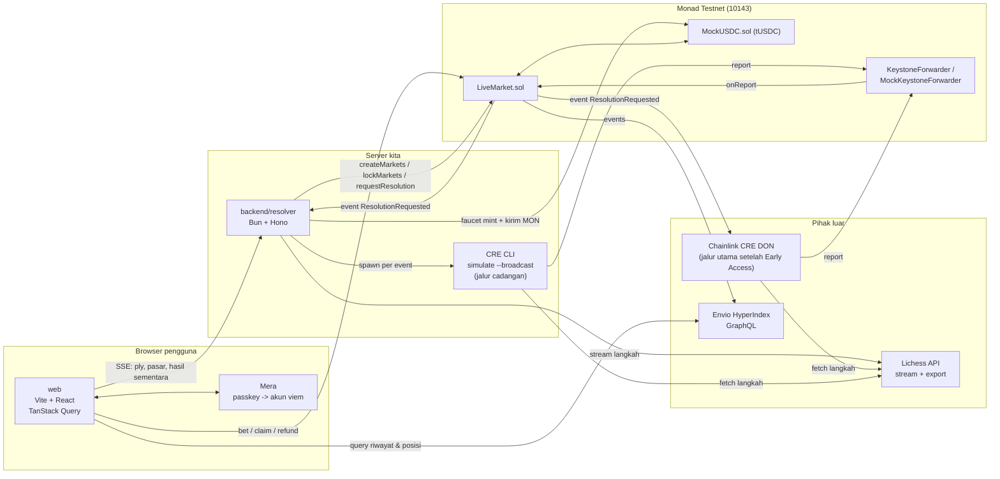

# Arsitektur: MoveMarket

> Nilai kanonik (enum, konstanta, ABI, alamat, format data, teks UI) ada di `docs/SOT.md` dan folder `sot/`. Kalau dokumen ini berbeda dengan SOT, SOT yang benar.

## 1. Gambaran sistem

## 2. Komponen

| Komponen | Tanggung jawab | Tidak boleh |
|---|---|---|
| `smart-contract/LiveMarket.sol` | Lifecycle pasar, escrow tUSDC, validasi waktu, terima report CRE, klaim, refund, void | Menentukan hasil sendiri, mempercayai data selain dari forwarder |
| `smart-contract/MockUSDC.sol` | Token testnet 6 desimal, mint oleh faucet | Dipakai di mainnet |
| `source/shared` | `resolve.ts` (tanpa dependensi), `abi.ts` (encoder report dan `gameKey` dengan viem), tipe, konstanta dari `sot/` | API Node. Dependensi apa pun di `resolve.ts` |
| `backend/resolver` | Ingest Lichess, state partai, perencana pasar, transaksi admin, hasil sementara, SSE, faucet, replay, runner CRE | Menulis hasil final ke kontrak secara langsung |
| `backend/cre/resolver-workflow` | Resolusi final: baca pasar, fetch Lichess, konsensus, tulis report | Memakai waktu lokal, API Node, atau nilai threshold dari report |
| `indexer` | Riwayat pasar, taruhan, posisi, statistik pengguna | Menjadi sumber kebenaran untuk izin transaksi |
| `web` | UI, akun Mera, transaksi pengguna, tampilan live | Menyimpan kunci privat |

## 3. Alur data ringkas

1. **Ingest:** resolver membuka stream Lichess (broadcast round atau TV) dan menyimpan daftar SAN per partai di memori.
2. **Buat pasar:** setiap N ply, perencana pasar menyusun batch pasar dan resolver mengirim satu transaksi `createMarkets`.
3. **Bertaruh:** frontend memanggil `bet()` langsung ke kontrak dengan akun Mera.
3a. **Kunci:** taruhan tutup saat `lockTime` lewat, atau lebih awal saat resolver memanggil `lockMarkets` begitu ply `fromPly - LOCK_LEAD_PLIES` terlihat (SOT D11).
4. **Hasil sementara:** setiap ply baru, resolver menjalankan `resolve()` untuk pasar terkunci partai itu. Yang sudah pasti dikirim ke frontend via SSE.
5. **Request final:** resolver memanggil `requestResolution(gameRef, marketIds)` untuk pasar yang hasil sementaranya sudah pasti. Kontrak memancarkan `ResolutionRequested`.
6. **Final:** CRE (DON atau simulasi) dipicu event itu, membaca parameter pasar dengan `getMarkets`, mengambil langkah dari Lichess, menjalankan `resolve()` yang sama, lalu menulis report batch lewat forwarder ke `onReport`.
7. **Klaim:** frontend membaca status final (dari kontrak atau indexer) dan memanggil `claim()` atau `refund()`.

Detail tiap langkah ada di `docs/SEQUENCES.md`.

## 4. Oracle dua lapis

| Lapis | Sumber | Kecepatan | Kegunaan | Membuka klaim |
|---|---|---|---|---|
| Sementara | Resolver service | < 2 detik setelah ply penentu | Pengalaman pengguna | Tidak |
| Final | Workflow CRE | Puluhan detik sampai 2 menit | Keamanan dana | Ya |

Keduanya memanggil `resolve()` dari `source/shared`. Resolver memakai stream live untuk hasil sementara, CRE memakai export (SOT bagian 7.2). Sebelum request, resolver mengecek export yang sama dengan CRE (SOT D17), jadi hasil final seharusnya selalu sama. `MarketVoided` karena pool pemenang kosong dihitung cocok. Selain itu, perbedaan adalah bug dan dicatat sebagai insiden (lihat bagian 10).

### Dua jalur eksekusi CRE

| Mode | Kapan | Cara | Forwarder yang dipercaya |
|---|---|---|---|
| `simulate` | Sebelum Early Access disetujui | Resolver menjalankan `cre workflow simulate ... --broadcast` per event | `MockKeystoneForwarder` |
| `don` | Setelah Early Access dan deploy | Workflow terdaftar di DON, dipicu log trigger otomatis | `KeystoneForwarder` |
| `mock` | VPS sebelum Early Access, tanpa CLI `cre` (SOT D23) | Resolver menjalankan langkah handler yang sama dan memanggil `report()` MockKeystoneForwarder langsung dengan wallet resolver. Tanpa konsensus multi-node, dipercaya seperti resolver | `MockKeystoneForwarder` |

Perpindahan mode: deploy workflow, panggil `setForwarder(keystoneForwarder)`, set `CRE_MODE=don` di resolver.

## 5. Model kepercayaan

| Pihak | Dipercaya untuk | Tidak dipercaya untuk | Mitigasi |
|---|---|---|---|
| Resolver | Membuat pasar dengan parameter wajar, mengunci pasar tepat waktu, meminta resolusi tepat waktu | Menentukan hasil final | Hasil final hanya dari forwarder. Kontrak memvalidasi parameter pasar. |
| Lichess | Data langkah partai | Ketersediaan 100% | Refund setelah `resolveDeadline`, admin void |
| CRE / forwarder | Menulis hasil sesuai data Lichess | Mengubah lifecycle pasar | Kontrak cek pasar milik partai yang sama, status masih terbuka, outcome valid |
| Owner kontrak | Pause, ganti forwarder/resolver, void | Memilih pemenang | Tidak ada fungsi admin untuk set YES/NO |

**Asumsi yang disadari:** resolver memilih `lockTime` dan `plyGap`, dan resolver juga yang memanggil `lockMarkets`. Resolver yang jahat atau lambat bisa membiarkan pasar terbuka saat rentangnya sudah dekat. Untuk MVP ini diterima dan disebut terbuka di README. Perbaikan masa depan: CRE memverifikasi bahwa ply `fromPly - 1` belum dimainkan saat `lockTime` (butuh timestamp per ply dari sumber data).

## 6. Keputusan desain

Daftar keputusan D1 sampai D16 beserta alasan dan alternatif yang ditolak ada di `docs/SOT.md` bagian 15. Jangan menulis ulang tabelnya di sini.

Keputusan yang paling berpengaruh ke arsitektur:
- D4 oracle dua lapis, D5 log trigger + batch per partai, D10 owner hanya bisa void.
- D11 kunci ply lewat `lockMarkets`.
- D12 broadcast turnamen sebagai sumber live utama.
- D14 dan D16 menjaga biaya gas, karena Monad menagih gas limit.

## 7. Kuota dan batas eksternal

### Chainlink CRE

| Kuota | Nilai | Dampak desain |
|---|---|---|
| HTTP trigger | 1 per 60 detik | Tidak dipakai untuk resolusi |
| EVM log trigger | 10 event per 6 detik | Batch pasar per partai per event |
| HTTP request per eksekusi | 5 | Satu fetch Lichess per partai |
| EVM read per eksekusi | 15 | Pakai satu panggilan `getMarkets(ids)` |
| Ukuran report | 5 KB | Maksimal sekitar 60 pasar per report, batasi 40 |
| Gas per transaksi write | 5.000.000 | Resolver mengirim maksimal 8 pasar per request. `gasLimit` diukur, bukan 3 juta (SOT D14) |
| Eksekusi bersamaan per workflow | 10 | Cukup untuk beberapa partai paralel |
| Workflow di registry privat | 3 per organisasi | Satu workflow resolver sudah cukup |
| Deploy | Butuh Early Access | Jalur `simulate --broadcast` sebagai cadangan |

### Lichess

- Stream broadcast round: satu koneksi per round (sumber live utama).
- Stream per game dan TV feed: hanya untuk sumber TV (Could), satu koneksi per game.
- Export game dan export chapter: satu fetch per batch request oleh resolver (prasyarat D17) dan satu per eksekusi CRE.
- Jangan polling endpoint stream. Kalau kena HTTP 429, tunggu 60 detik.

## 8. Konfigurasi dan environment

### Jaringan

| Nama | Nilai |
|---|---|
| Chain | Monad Testnet |
| Chain ID | `10143` |
| RPC | dari `MONAD_TESTNET_RPC` |
| Envio HyperSync | `https://10143.hypersync.xyz` |

### `backend/resolver/.env`

| Variabel | Contoh | Keterangan |
|---|---|---|
| `MONAD_TESTNET_RPC` | `https://testnet-rpc.monad.xyz` | RPC publik untuk development. Server 24 jam sebaiknya memakai RPC dari sponsor (QuickNode, Dwellir, Chainstack) |
| `MONAD_TESTNET_WS` | `wss://...` | Sumber utama event watcher (`eth_subscribe` logs). Polling hanya cadangan |
| `LIVE_MARKET_ADDRESS` | `0x...` | |
| `MOCK_USDC_ADDRESS` | `0x...` | |
| `RESOLVER_PRIVATE_KEY` | (secret) | Role resolver + minter tUSDC. Jaga saldo di atas 20 MON |
| `FAUCET_PRIVATE_KEY` | (secret) | Wallet terpisah untuk kirim MON ke pengguna (D19). Minimal 10,5 MON agar transfer tidak revert |
| `FAUCET_USDC_AMOUNT` | `50000000` | 50 tUSDC |
| `FAUCET_MON_AMOUNT` | `500000000000000000` | 0,5 MON, sekitar 25 transaksi |
| `CRE_MODE` | `simulate` / `don` / `mock` / `off` | `mock` (SOT D23): tanpa CLI `cre` dan kredensialnya, report lewat MockKeystoneForwarder oleh wallet resolver. Hanya testnet |
| `CRE_PROJECT_DIR` | `../cre` | |
| `CRE_TARGET` | `staging-settings` | |
| `ADMIN_TOKEN` | (secret) | Untuk endpoint `/admin/*` |
| `PLY_GAP_CLASSICAL` | `2` | |
| `PLY_GAP_RAPID` | `4` | |
| `WINDOW_PLIES` | `4` | |
| `LOCK_LEAD_PLIES` | `1` | Kunci ply, SOT D11 |
| `SPAWN_EVERY_PLIES` | `4` | |
| `BET_WINDOW_SEC` | `15` | |
| `RESOLVE_DEADLINE_SEC` | `21600` | 6 jam setelah `lockTime` |
| `CORS_ORIGIN` | `https://<domain-demo>` | |
| `TRUST_PROXY` | `false` | Default `false`: IP klien untuk kuota faucet dari alamat socket. `true` hanya di belakang proxy tepercaya: IP dari entri pertama `X-Forwarded-For` |

Baris `PLY_GAP_*`, `WINDOW_PLIES`, `LOCK_LEAD_PLIES`, `SPAWN_EVERY_PLIES`, `BET_WINDOW_SEC`, dan `RESOLVE_DEADLINE_SEC` mencatat nilai SOT bagian `planner`. Implementasi saat ini (`markets/planner.ts`) membacanya langsung dari `SOT.planner`; `config.ts` tidak membaca env tersebut.

### `fe/.env`

| Variabel | Keterangan |
|---|---|
| `VITE_CHAIN_ID` | `10143` |
| `VITE_RPC_URL` | RPC publik |
| `VITE_RESOLVER_URL` | URL resolver |
| `VITE_ENVIO_URL` | Endpoint GraphQL Envio |
| `VITE_LIVE_MARKET_ADDRESS` | |
| `VITE_MOCK_USDC_ADDRESS` | |
| `VITE_RP_ID` | Domain passkey, harus sama dengan domain deploy |

### `backend/cre/` config (lihat `docs/CRE_WORKFLOW.md`)

`chainSelectorName`, `liveMarketAddress`, `gasLimit`, `lichessBaseUrl`, `maxMarketsPerReport`.

## 9. Topologi deploy

| Bagian | Tempat | Catatan |
|---|---|---|
| `web` | Vercel atau Cloudflare Pages (statis) | Domain tetap sejak hari pertama karena rpId passkey |
| `backend/resolver` | VPS atau container (Fly.io, Railway, VPS biasa) | Proses panjang 24 jam. Container harus berisi binary CRE CLI dan proyek `backend/cre/` untuk mode `simulate` |
| `indexer` | Envio Cloud (CLI `envio-cloud`, deploy dari GitHub) | Kontrak harus terverifikasi dulu |
| `contracts` | Monad Testnet | Verifikasi lewat API `agents.devnads.com/v1/verify` (MonadVision, Socialscan, Monadscan sekaligus) |
| `cre` | Lokal (simulasi) atau DON (setelah deploy) | |

## 10. Mode gagal dan penanganan

| Kegagalan | Gejala | Penanganan |
|---|---|---|
| Stream Lichess putus | Ply berhenti bertambah | Reconnect dengan backoff, tidak membuat pasar baru selama putus |
| Partai berakhir sebelum rentang selesai | Pasar tidak bisa YA/NO | `resolve()` mengembalikan `VOID` |
| Resolver mati | Tidak ada pasar baru, tidak ada request resolusi | Pasar lama bisa di-refund setelah `resolveDeadline`. Restart resolver membaca ulang pasar terbuka dari kontrak |
| CRE gagal / lambat | Final tidak datang | Resolver retry request (maksimal 3 kali), lalu `adminVoid` kalau tetap gagal |
| Hasil sementara beda dengan final | Inkonsistensi | Final yang berlaku. Log insiden, perbaiki `resolve.ts` atau sumber data |
| Nonce resolver bentrok | Tx resolver gagal | Antrian transaksi tunggal di resolver, nonce manager viem |
| Kunci ply gagal atau terlambat | Taruhan masih masuk setelah `fromPly - 1` terlihat | `lockMarkets` diprioritaskan di antrian, log `lock_failed`. Kunci waktu kontrak tetap berlaku. Pasar terdampak boleh di-`adminVoid` |
| MON wallet resolver menipis | Di bawah 10 MON akun dibatasi 1 transaksi per 3 blok, lock bisa terlambat. Transfer faucet revert | Alert di 20 MON, wallet faucet terpisah, replay otomatis hanya saat ada penonton (D16), isi ulang lewat faucet agen Monad |
| Faucet habis MON | Pengguna baru tidak bisa transaksi | Alert di log, isi ulang wallet resolver dari faucet Monad |

## 11. Keamanan

- `LiveMarket`: ReentrancyGuard di `claim`, `refund`, `bet`. SafeERC20. Checks-effects-interactions.
- Integritas pasar: kunci waktu di kontrak plus kunci ply oleh resolver (`lockMarkets`). `lockTime` hanya bisa maju.
- `onReport` hanya menerima `msg.sender == forwarder`. Validasi setiap pasar: ada, milik `gameKey` yang sama, belum final, sudah lewat `lockTime`, outcome dalam `{YES, NO, VOID}`. Pasar yang tidak valid dilewati dengan event `ResolutionSkipped`, tidak me-revert seluruh batch.
- Batas taruhan: minimum 1 tUSDC, maksimum 100 tUSDC per pengguna per pasar.
- Endpoint `/admin/*` memakai `ADMIN_TOKEN`. Endpoint `/faucet` dibatasi per alamat dan per IP.
- Frontend tidak pernah menyimpan kunci. Sesi Mera hanya di memori.
- Workflow CRE: tidak membaca secret, tidak memakai waktu lokal, konsensus untuk data HTTP.

## 12. Observability

- Resolver: log JSON per event (`ply`, `market_created`, `market_locked`, `lock_failed`, `provisional`, `resolution_requested`, `cre_run_started`, `cre_run_finished`, `finalized`, `mismatch`).
- Endpoint `GET /health` dan `GET /metrics` sederhana (jumlah partai dilacak, pasar terbuka, antrian CRE, saldo wallet resolver).
- Simpan hash transaksi setiap report CRE untuk ditampilkan di UI dan README.
