# Sequence Diagrams: MoveMarket

> Nilai kanonik (enum, konstanta, ABI, alamat, format data, teks UI) ada di `docs/SOT.md` dan folder `sot/`. Kalau dokumen ini berbeda dengan SOT, SOT yang benar.

Semua nama fungsi, event, dan endpoint mengikuti `sot/abi.json`, `docs/CONTRACTS.md`, `docs/RESOLVER_SERVICE.md`, dan `docs/CRE_WORKFLOW.md`. Diagram yang sama tampil di `docs/movemarket-flows.html` dan halaman artifact "MoveMarket Flows".

Daftar diagram:
1. Onboarding dengan passkey dan faucet
2. Unlock setelah reload
3. Ingest langkah dan pembuatan pasar
4. Kunci ply
5. Stake
6. Hasil sementara
7. Resolusi final lewat CRE (mode simulate)
8. Resolusi final lewat CRE (mode DON)
9. Retry dan kegagalan
10. Claim
11. Void dan refund
12. Mode replay
13. Isi ulang gas

---

## 1. Onboarding dengan passkey dan faucet

Mera hanya memberi output PRF 32 byte. Derivasi kunci ada di aplikasi (SOT bagian 12). Approve dikirim saat onboarding, 3 blok setelah dana masuk (D21).

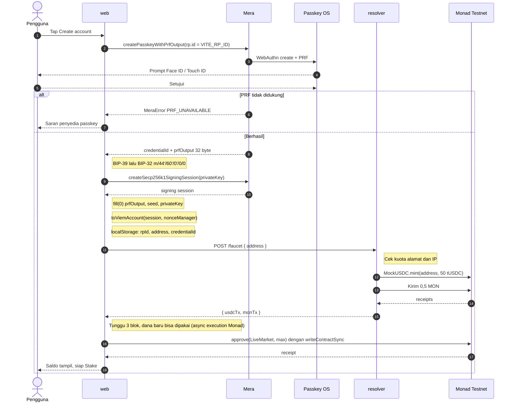

---

## 2. Unlock setelah reload

Satu prompt passkey per sesi. Setelah itu stake tidak meminta passkey lagi.

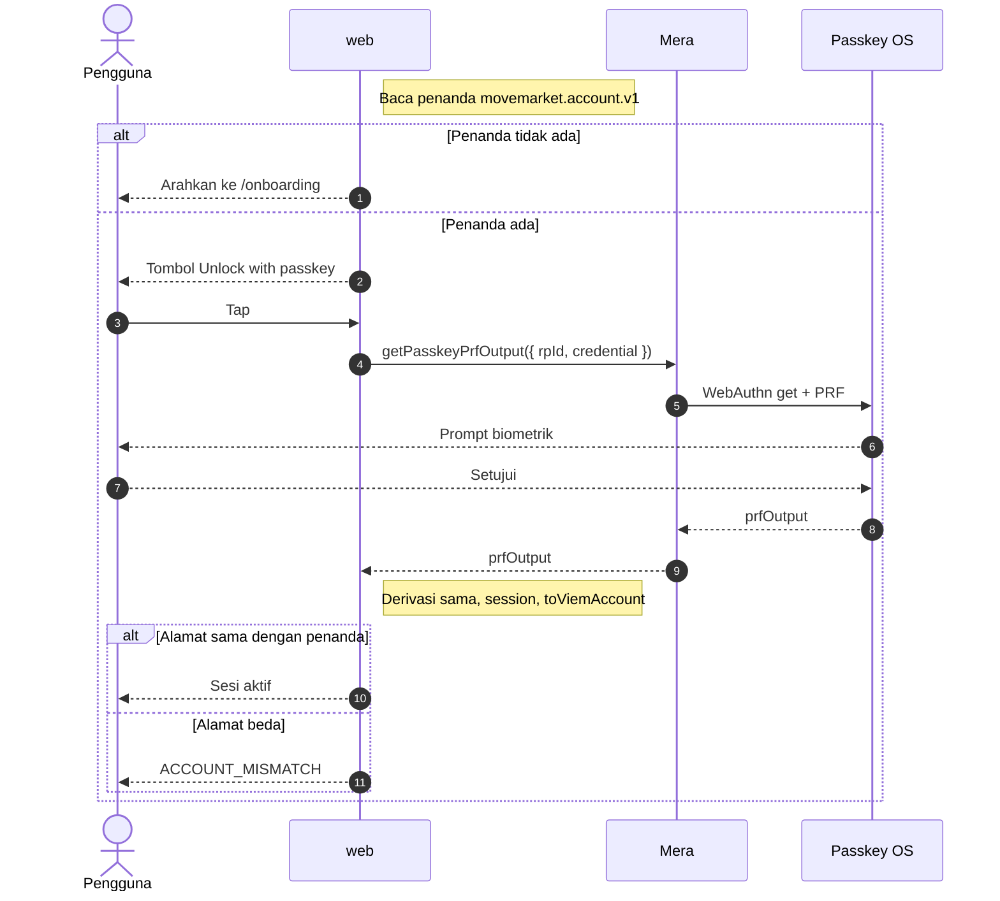

---

## 3. Ingest langkah dan pembuatan pasar

Sumber live utama adalah stream PGN broadcast (D12). Replay memakai alur yang sama.

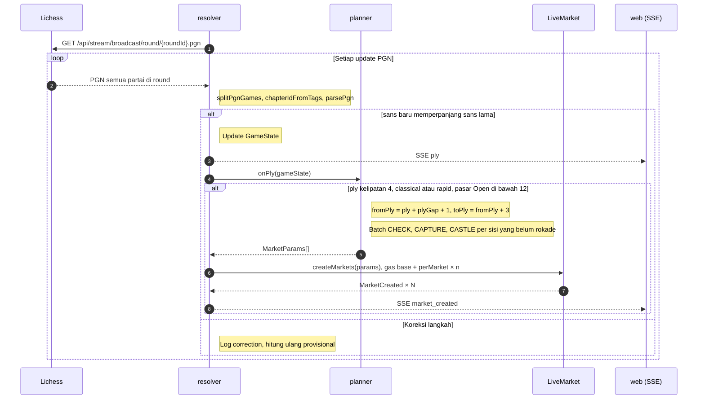

---

## 4. Kunci ply

Taruhan tutup saat 15 detik lewat atau saat ply fromPly - 1 terlihat, mana yang lebih dulu (D11).

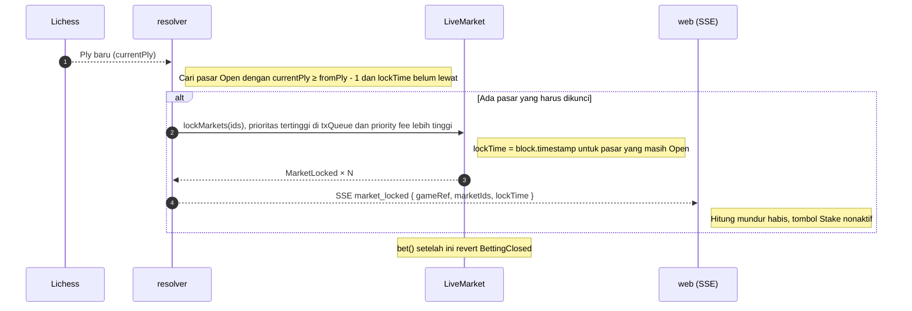

---

## 5. Stake

Optimistic update di TanStack Query, kontrak tetap penentu akhir.

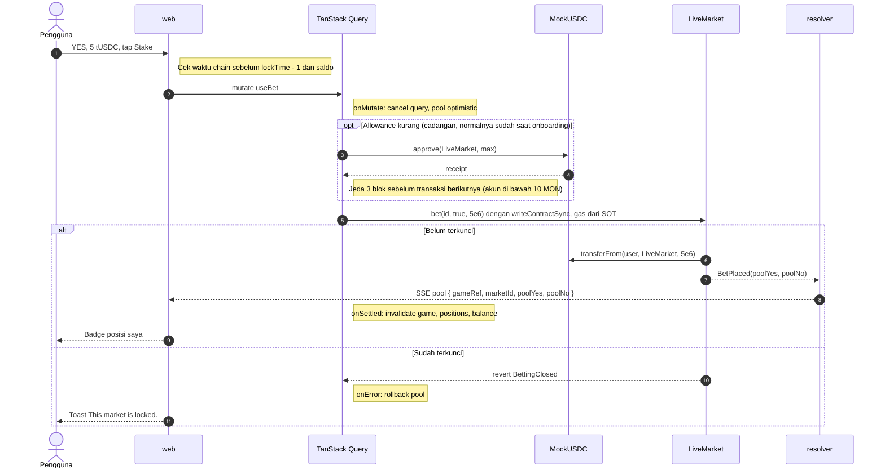

---

## 6. Hasil sementara

Dihitung setiap ply baru. Pasar tanpa stake tidak pernah dikirim ke CRE (D18).

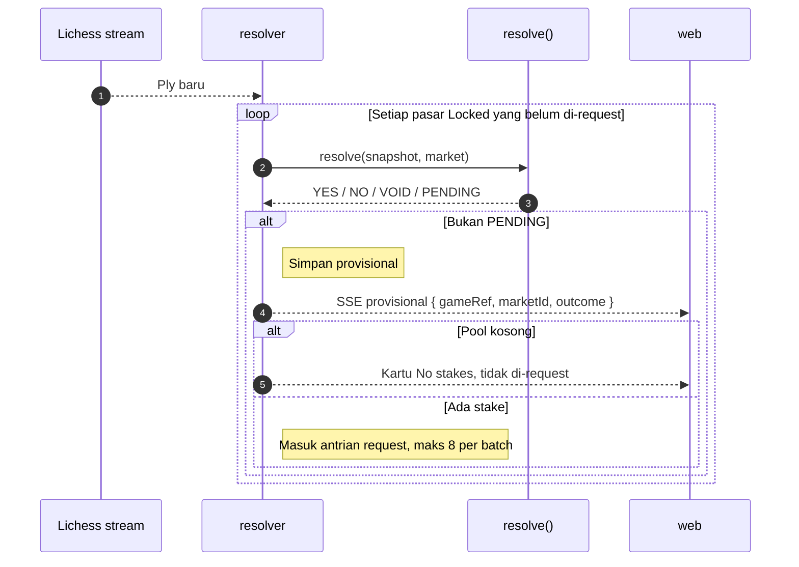

---

## 7. Resolusi final lewat CRE (mode simulate)

Resolver mengecek export Lichess yang sama dengan CRE sebelum request (D17), dan hanya bertindak pada blok finalized (D20).

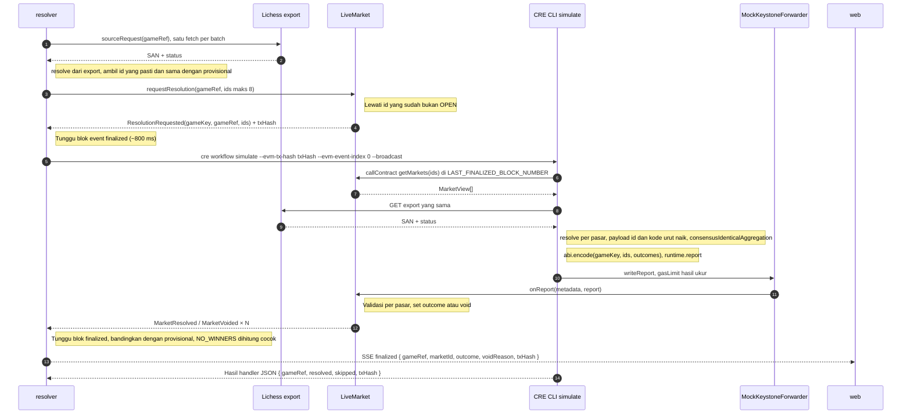

---

## 8. Resolusi final lewat CRE (mode DON)

Dipakai setelah Early Access disetujui, workflow di-deploy, dan setForwarder(KeystoneForwarder) dipanggil.

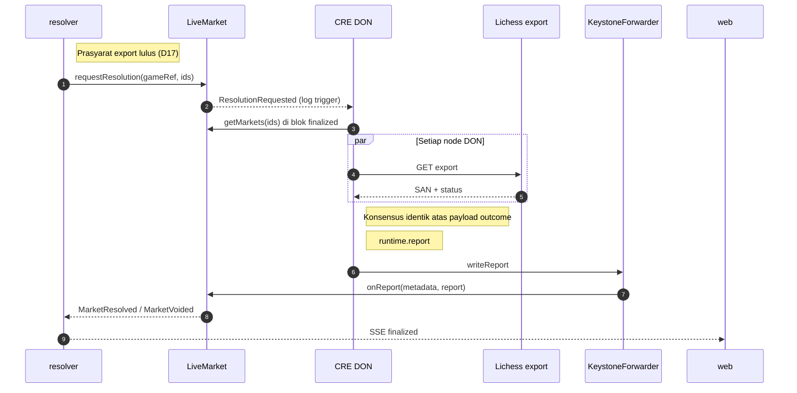

---

## 9. Retry dan kegagalan

Retry hanya untuk id yang masih OPEN. Kontrak juga melewati id non-OPEN, jadi hasil parsial tidak membuat request macet.

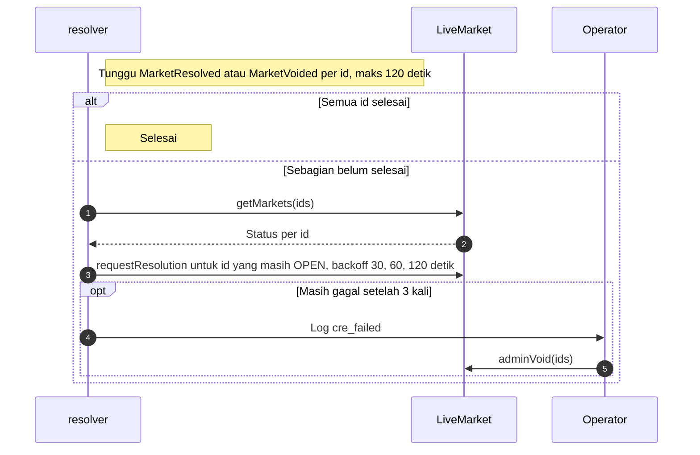

---

## 10. Claim

Posisi dibaca dari Envio. Kalau indexer bermasalah, web memakai GET /positions/:address dari resolver.

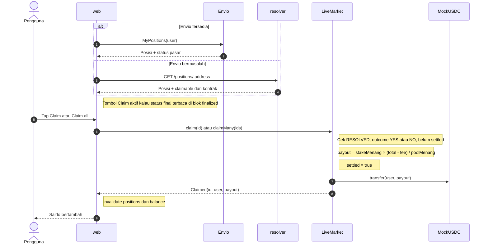

---

## 11. Void dan refund

Empat jalan menuju refund. Setiap void mengisi status VOIDED dan outcome VOID.

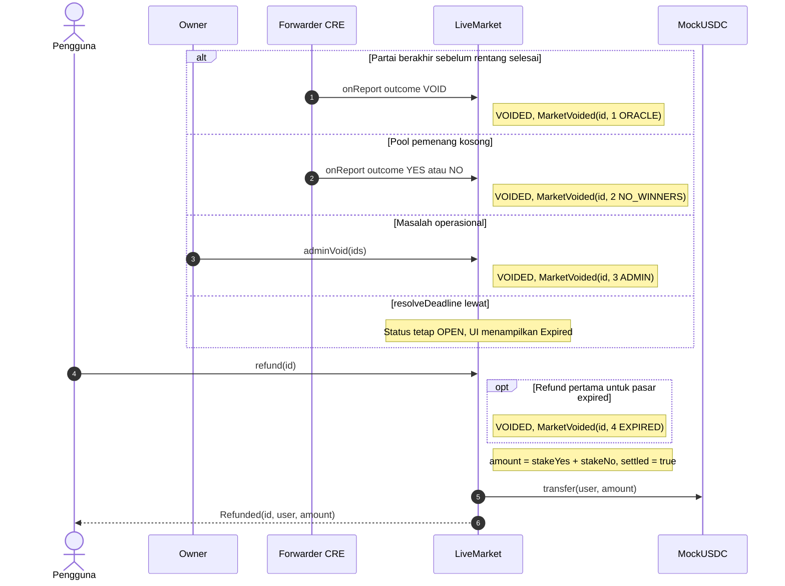

---

## 12. Mode replay

Replay otomatis hanya saat ada penonton (D16). Tanpa penonton, replay tetap jalan sampai pasar ber-stake final.

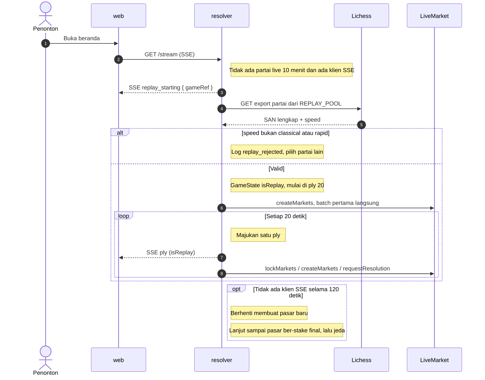

---

## 13. Isi ulang gas

Monad menagih gas limit, jadi saldo MON bisa habis lebih cepat dari perkiraan. Kuota isi ulang terpisah dari faucet onboarding, dan dikirim dari wallet faucet yang terpisah dari resolver (D19).

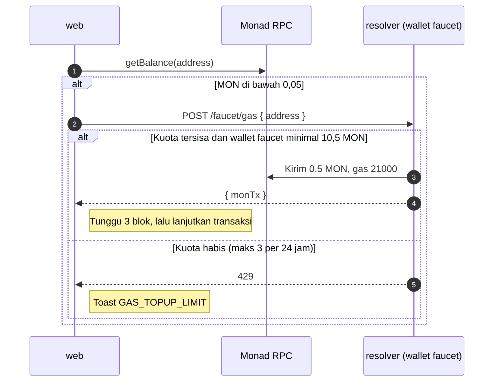
