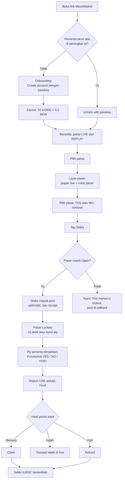
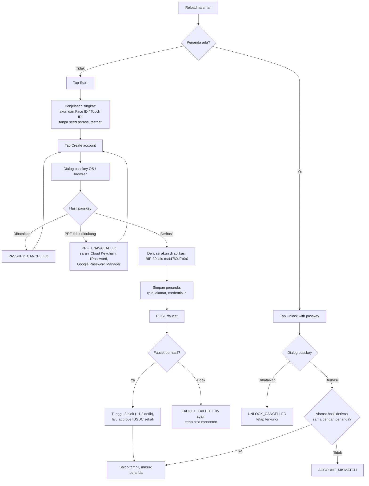
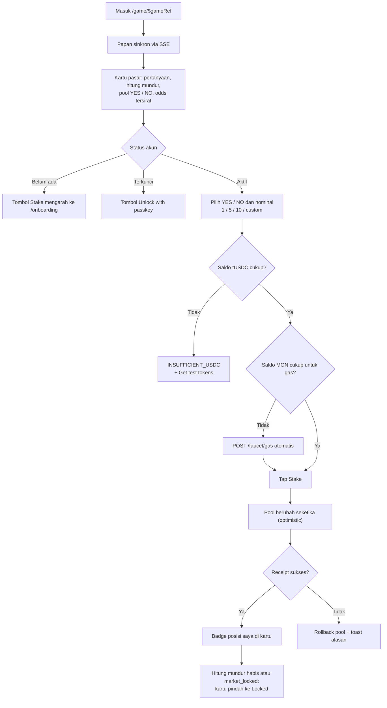
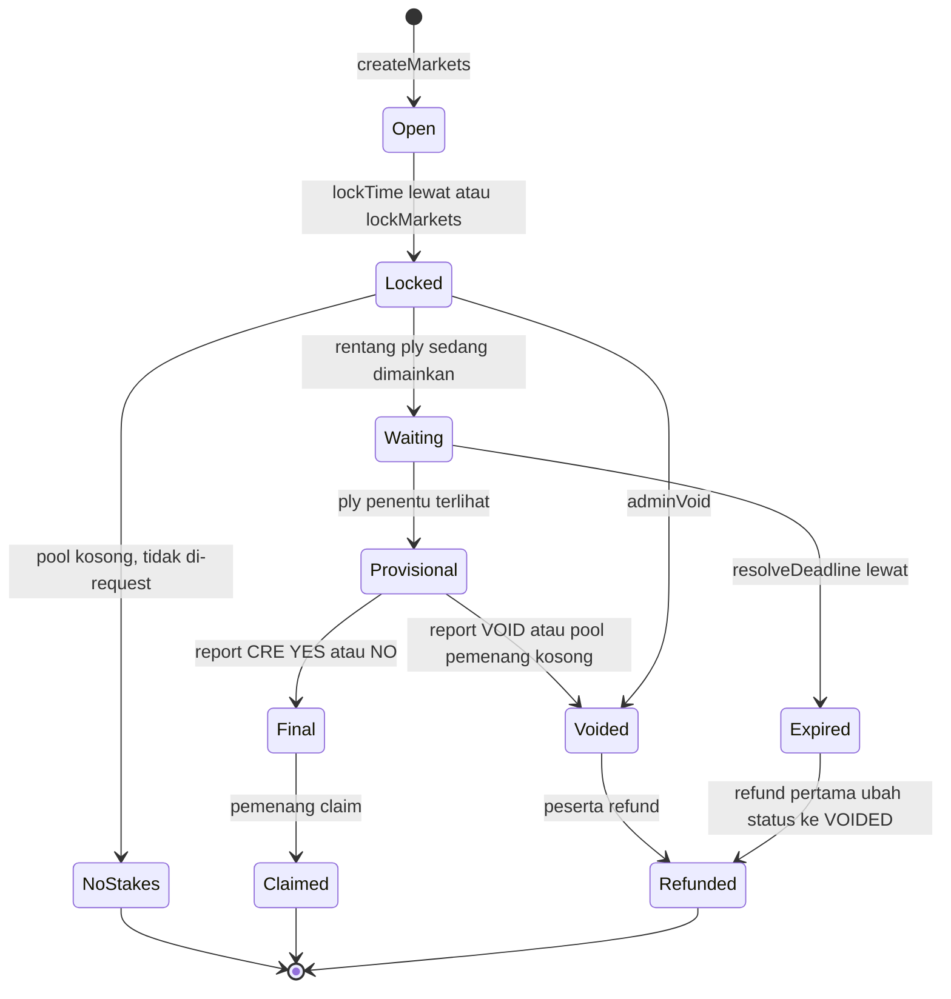
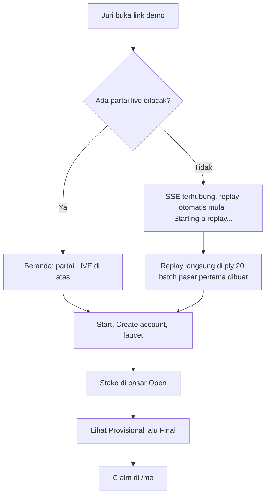
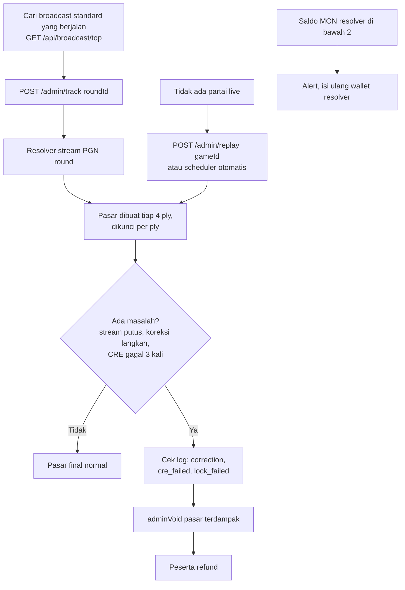

# User Flow: MoveMarket

> Nilai kanonik (enum, konstanta, ABI, alamat, format data, teks UI) ada di `docs/SOT.md` dan folder `sot/`. Kalau dokumen ini berbeda dengan SOT, SOT yang benar.

Dokumen ini menjelaskan alur dari sisi pengguna: layar yang dilihat, aksi yang dilakukan, dan state error yang harus ditangani. Detail teknis antar komponen ada di `docs/SEQUENCES.md`.

UI berbahasa Inggris (SOT D15). Teks persis untuk label, tombol, dan pesan ada di `sot/copy.en.json`. Diagram di dokumen ini memakai bahasa Indonesia hanya untuk menjelaskan alur; nama tombol ditulis sesuai UI.

## 1. Peta layar

| Route | Layar | Isi utama |
|---|---|---|
| `/` | Beranda | Daftar partai live dan replay, tombol "Start" untuk pengguna baru |
| `/onboarding` | Buat akun | Penjelasan singkat, tombol buat passkey, status faucet |
| `/game/$gameRef` | Layar partai | Papan live, info pemain, pasar terbuka, pasar terkunci, riwayat |
| `/me` | Profil | Saldo, posisi aktif, posisi menang yang bisa diklaim, refund, riwayat |
| `/leaderboard` | Leaderboard | Peringkat profit bersih (C, hanya kalau Must selesai) |

Komponen global: header dengan saldo tUSDC, badge "Monad Testnet", toast untuk status transaksi.

## 2. Alur utama

## 3. Alur onboarding dan unlock

Catatan:
- Kunci privat tidak pernah disimpan. Setiap kali halaman dimuat ulang, pengguna membuka sesi dengan passkey satu kali. Selama sesi aktif, taruhan tidak meminta passkey lagi.
- Passkey terikat ke domain (rpId). Domain demo harus tetap sama sejak hari pertama.
- Pengguna yang belum punya akun tetap bisa menonton papan dan pasar. Tombol taruhan mengarahkan ke onboarding.

## 4. Alur menonton dan bertaruh

Isi kartu pasar:
- Pertanyaan dari `describeMarket`, contoh: "Any check in plies 31 to 34 (moves 16 to 17)?" atau "White castles in plies 18 to 25 (moves 9 to 13)?"
- Hitung mundur sampai `lockTime`. Kartu bisa terkunci lebih awal saat kunci ply terjadi (SOT D11)
- Pool YES dan NO, odds tersirat = total pool / pool sisi tersebut (setelah fee)
- Posisi saya (kalau ada)

## 5. Alur hasil, klaim, dan refund

Label status di UI:

| State | Key di `copy.en.json` | Contoh label | Aksi pengguna |
|---|---|---|---|
| Open | `market.status.open` | "Open · 0:12" | Stake |
| Locked | `market.status.locked` | "Locked" | Tidak ada |
| Waiting | `market.status.waiting` | "Waiting for ply 34" | Tidak ada |
| Provisional | `market.status.provisional` | "Provisional: YES" | Tidak ada, tunggu final |
| Final | `market.status.final` | "Final: YES" | Claim kalau menang |
| Voided | `market.status.voided` | "Voided" | Refund |
| Voided, pool pemenang kosong | `market.status.voidedNoWinners` | "Voided: no winning stakes" | Refund |
| Expired | `market.status.expired` | "Expired" | Refund |
| NoStakes | `market.status.noStakes` | "No stakes" | Tidak ada (tidak pernah di-request, D18) |

## 6. Alur juri (mode replay)

Target: taruhan pertama kurang dari 60 detik setelah membuka link. Replay baru langsung dimulai di ply `REPLAY_START_PLY` (20, kelipatan `SPAWN_EVERY_PLIES`), jadi batch pasar pertama dibuat saat itu juga.

## 7. Alur operator (admin)

## 8. State error dan pesan

Teks pesan ada di `sot/copy.en.json` bagian `errors`.

| Kondisi | Key `errors.*` | Perilaku |
|---|---|---|
| PRF tidak didukung (`MeraError` `PRF_UNAVAILABLE`) | `PRF_UNAVAILABLE` | Kembali ke tombol buat akun |
| Pengguna membatalkan dialog passkey saat membuat akun (`PASSKEY_OPERATION_FAILED`) | `PASSKEY_CANCELLED` | Tetap di onboarding |
| Pengguna membatalkan dialog passkey saat unlock | `UNLOCK_CANCELLED` | Tetap terkunci, tombol unlock tetap ada |
| Browser tanpa Web Crypto (`CRYPTO_UNAVAILABLE`) | `CRYPTO_UNAVAILABLE` | Sarankan Chrome atau Safari terbaru |
| Sesi berakhir (`SESSION_ENDED`) | `SESSION_ENDED` | Kembali ke status terkunci |
| Alamat hasil unlock beda dengan penanda | `ACCOUNT_MISMATCH` | Jangan pakai akun itu, tawarkan buat akun baru |
| Batas isi ulang gas tercapai | `GAS_TOPUP_LIMIT` | Tidak ada aksi sampai besok |
| Faucet gagal / limit | `FAUCET_FAILED` | Tombol coba lagi |
| Saldo tUSDC kurang | `INSUFFICIENT_USDC` | Tombol faucet |
| Saldo MON untuk gas kurang | `INSUFFICIENT_GAS` | Panggil `POST /faucet/gas` otomatis |
| Taruhan setelah terkunci | `BettingClosed` | Rollback optimistic |
| Melebihi batas taruhan | `StakeCapExceeded` | Tidak kirim tx |
| Nonce bentrok | (tidak ditampilkan) | Retry otomatis sekali |
| SSE putus | `SSE_RECONNECTING` (banner) | Reconnect dengan backoff, refetch state partai |
| Resolver offline | `RESOLVER_OFFLINE` (banner) | Pasar tetap terbaca dari indexer |
| Final belum datang lama | `FINAL_PENDING` | Tidak ada aksi, refund tersedia setelah `resolveDeadline` |

## 9. Copy dan istilah

- Semua teks UI berbahasa Inggris dan diambil dari `sot/copy.en.json`.
- Pertanyaan pasar menampilkan nomor ply dan nomor langkah catur, contoh "plies 31 to 34 (moves 16 to 17)".
- Jangan memakai kata "gamble" atau "bet" di UI. Pakai "predict", "stake", "pool".
- Badge "Monad Testnet" selalu terlihat di header. Partai replay diberi badge "REPLAY".
